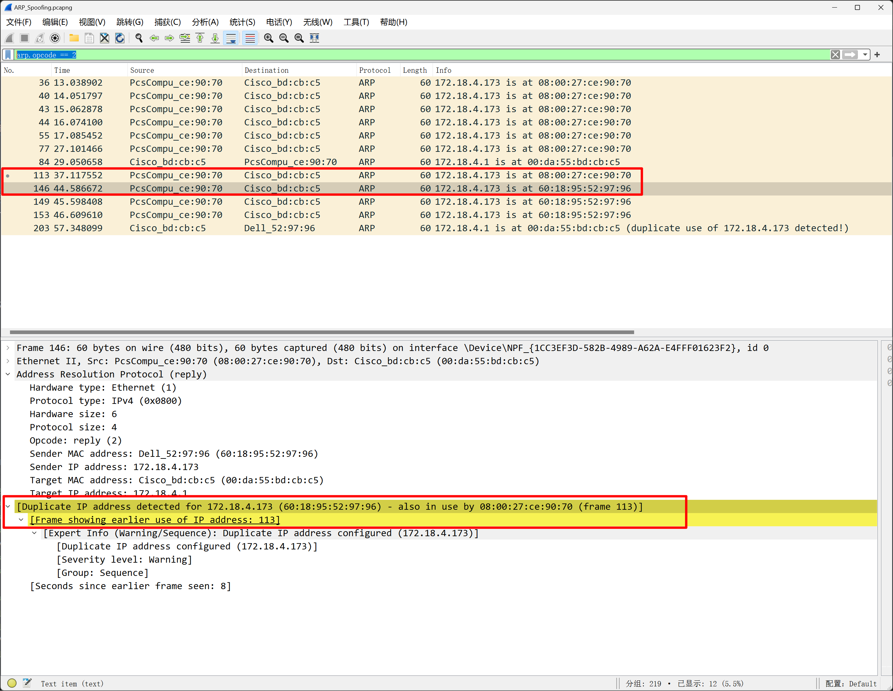

# ARP Spoofing

## 题目

Someone is on our network; we must find the intruder. To do so, we have captured the traffic where the attacker is located

[arp.pcapng](./files/arp.pcapng)

The format for the flag is flag{MAC_ADDRESS}


## 考点

- `Misc`
- `ARP Spoofing`


## WriteUp

- `arp.opcode == 2`过滤出ARP回复数据包
- 
- IP地址172.18.4.173上检测到了重复的MAC地址。具体地，MAC地址60:18:95:52:97:96 和 08:00:27:ce:90:70 都被使用在了IP地址172.18.4.173上（在第113帧中）。

## FLAG

```plain
flag{08:00:27:ce:90:70}
```
