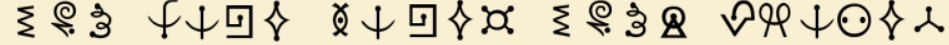

# Decoding the Omicronian Alien Alphabet: Translate to Survive!

## 题目

The solution you seek is near. I'll give you some clues... You have one, too. You carry it everywhere you go but it's not heavy. It can be clean, or it can be Mudd. It doesn't change how a rose smells. 



You will need this and this: poctf{uwsp_ _ _ }


## 考点

- `Crypto`
- `Futurama Alien Alphabet One`
- `奇形怪状的加密方式`


## WriteUp

- 通过google智能镜头，找到对应的[“密码本”](https://zh.fonts2u.com/futurama-alien-alphabet-one.%E5%AD%97%E4%BD%93)
- `Futurama Alien Alphabet One`字体，大小写是对应一个字符，这题的flag是全大写

## FLAG

```plain
flag{YOU HAVE SAVED YOUR PLANET}
```
