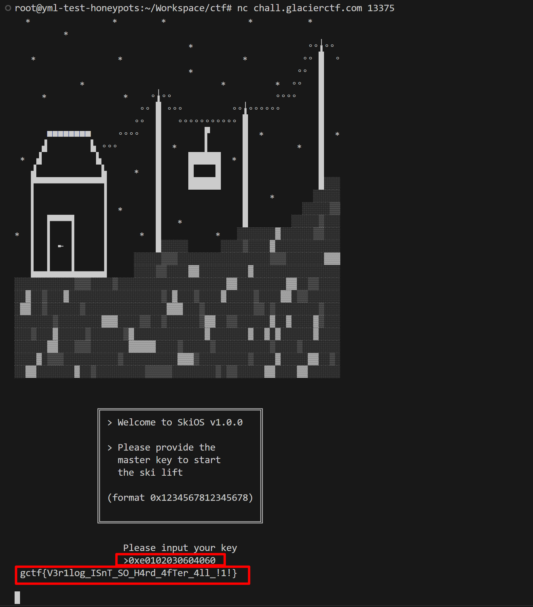

# Skilift

## 题目

You arrive at the base station of a ski lift. Unfortunately for you, the lift is not in operation but you have to reach the next summit somehow. You enter the control room to find a control terminal with the words "Please input your key:"

author: mole99

nc chall.glacierctf.com 13375

[top.v](./files/top.v)


## 考点

- `rev`


## WriteUp

- 依据`top.v`文件中的代码，编写[脚本](./files/key.py)计算出`key`值
- key值为`0xe0102030604060`
- nc连接后，输入key值，得到flag  
  

## FLAG

```plain
gctf{V3r1log_ISnT_SO_H4rd_4fTer_4ll_!1!}
```
