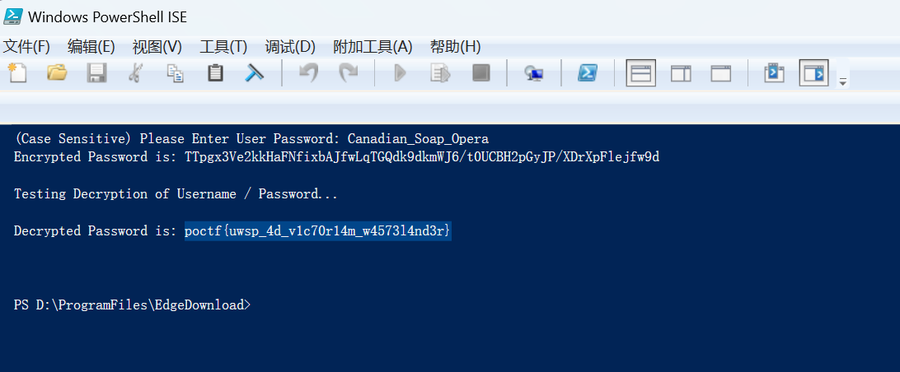

# Easy as it Gets

> reverse

## 题目描述

It doesn't get much easier than this when it comes to reverse engineering. Here we have a "secure" PowerShell script. All you need to do is figure out the super secret passphrase to decrypt the flag.

## 解题思路

用 powershell 运行一下脚本，密码在脚本中已给出：`Canadian_Soap_Opera`。（如果禁止运行的话，以管理员身份打开 powershell，执行命令 `Set-ExecutionPolicy Unrestricted -Scope CurrentUser`）

## flag

`poctf{uwsp_4d_v1c70r14m_w4573l4nd3r}`

## 参考资料

- [PowerShell禁止运行脚本](https://blog.csdn.net/tongxin_tongmeng/article/details/128150906)