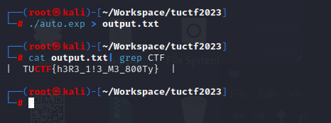

# Bludgeon the Booty

## 题目

You have found me treasure chest, but can you crack its code?

```
  ___________
 /           \
/__|0|0|0|0|__\
|      @      |
|_____________|
```

"This here lock be cursed by the shaman of the swamp to change keys for each attempt"

`nc chal.tuctf.com 30002`

## 考点

- `Programming`

## WriteUp

- 思路：暴力破解，编写脚本自动输入，遍历000-999，直到找到正确的密码。
- python3生成exp：[auto.py](./files/auto.py)
- exp：[auto.exp](./files/auto.exp)
- 执行：`./auto.exp > output.txt`
- 结果：
  

## FLAG

```plain
TUCTF{h3R3_1!3_M3_800Ty}
```
