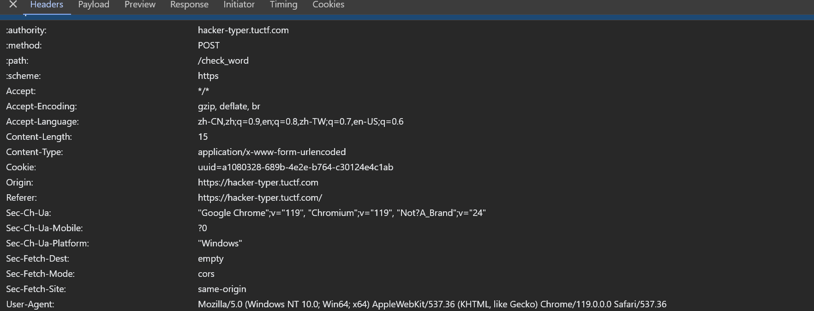
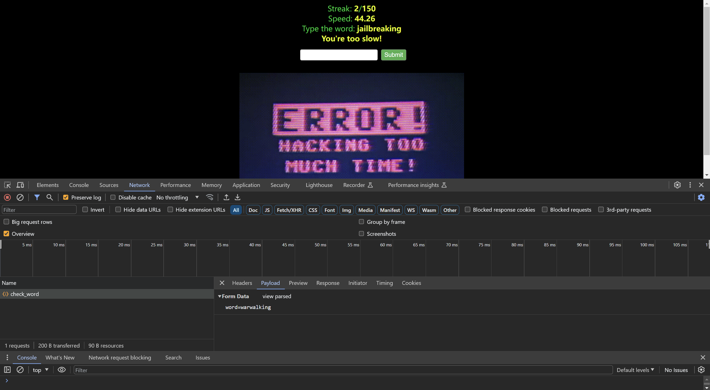

# Hacker Typer

## 题目

Only the most leet hackers can type faster than my bot. Can you beat it?

`https://hacker-typer.tuctf.com`


## 考点

- `Programming`

## WriteUp

- 在表单中输入界面上显示的单词，即可获得下一个单词，连续输入150次即可获得flag。
- 注意：输入太慢（＞5s）会清零计数器，输入错误会清零计数器。
- `F12`查看网络请求
  - request_header
  
  - payload
  
  - response
  

- 编写脚本[typingCha.py](./files/typingCha.py)：自动提交请求，获取下一个单词，直到获得flag。（这里次数≥152，因为第一次超时）

## FLAG

```plain
xx
```
