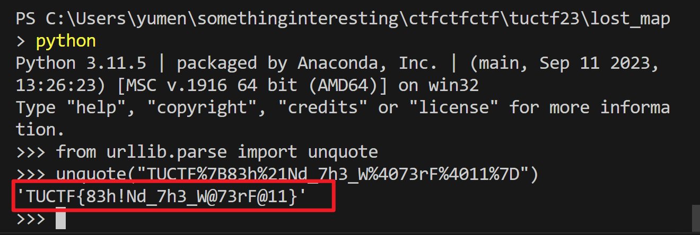

# Plenty O Fish in the Sea

## 题目

You have embarked on a quest to find the One Bit! Your first step is to find the scattered pieces of the treasure map on this here abandoned island!

[lost_map.zip](./files/lost_map.zip)


## 考点

- `Programming`

## WriteUp

- 思路：大文件处理，统计日志中不同命令常出现的次数，将仅出现一次的命令拼接，然后url解码即获得flag。
- 脚本：[process_log.py](./files/process_log.py)
- 统计结果：[res.json](./files/res.json)
- url解码：
  
## FLAG

```plain
TUCTF{83h!Nd_73h_W@73rF@11}
```
